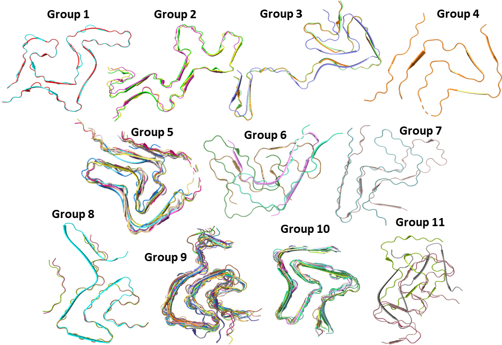

# Structural Analysis and Hierarchical Clustering of Solved Amyloid Structures

### Author: Jack P Connor
### Contact: bsjpc@leeds.ac.uk

### Last Updated 05-07-2023

## ABSTRACT

Aberrant aggregation of intrinsically disordered proteins into large, insoluble structures known as amyloids is of clinical importance and has been implicated in several diseases. For example, the aggregation of Amyloid-β and Tau into plaques and neurofibrillary tangles are pathological hallmarks of Alzheimer's Disease. Amyloids are large, fibrillar and insoluble biological polymers which are assembled noncovalently from β-strand rich monomers arranged perpendicular to the fibril axis creating a cross-β structure. The amyloid structures formed by these intrinsically disordered proteins display high levels of structural polymorphism. Several distinct amyloid folds can be adopted by a single protein with an identical primary sequence. In addition to the inherited polymorphism, primary sequence-altering mutations have also been shown to form distinct amyloid folds. Understanding amyloid polymorphism is of clinical significance as distinct α-synuclein polymorphs have been solved from different synucleinopathies. Given the clinical importance of amyloid structural variations and the drastically increasing rate of solved biomolecular structures being published, there is a critical need for the ability to characterise and compare amyloid structures in a high-throughput manner. The aim of this work is to create an analysis pipeline that can group amyloid structures into hierarchical clusters based on their structural properties. This pipeline can be used for any amyloid-forming protein and aims to cluster amyloid structures so that the factors influencing polymorphism and the structure-function relationship of amyloids can be explored.

## Features
* Web scrape the [Amyloid Atlas](https://people.mbi.ucla.edu/sawaya/amyloidatlas/) to access known published structures
* Include your own local PDB structures
* Identify unique chains from each PDB file (intra-PDB variation)
* Calculate the structural properties of each unique chain
* Calculate structural similarity between each unique chain using RMSD
* Hierarchical clustering of amyloid structures into defined groups based on their structural properties

  

## INSTALLATION
This is a work in progress. I am to write a script + documentation that will install all the required prerequisites.

## ANALYSIS PIPELINE

### Running the analysis

**run_analysis.sh**
The analysis pipeline is run in a Linux terminal using the script run_analysis.sh. In this script, you can change the run parameters to select which scripts you would like to run.

### PDB Alignment

**amyloid_atlas_scraper.py**

A web scraping script written in Python that extracts all the entries for a specific protein of interest from the [Amyloid Atlas](https://people.mbi.ucla.edu/sawaya/amyloidatlas/).

**get_pdb_names.py**

This script takes the result from web scraping (if selected) and all of the local PDB structures to create a list of objects to load into PyMol.

**fetch_pdb.py**

The 4-character PDB codes from web scraping are used to download the published structures and save them as .cif files.

**PDB_alignment.py**

The downloaded .cif files and any local PDB structures are imported into PyMol, separated into individual monomers, and aligned.

**delete_cif.py**

This script deletes all the downloaded PDB structures (the .cif files)

**create_df.R**

This script creates a data frame containing all of the coordinates of each atom for all monomer chains after alignment which is used for subsequent analysis.

### Analysis

**plot_ordered_residues.R**

This creates a simple plot showing the number of residues solved for each PDB structure so the variable length of the fibril core can be visualised.

**single_chain_analysis.R**
Amyloid folds can be made up of a single or multiple interacting protofilaments. Each protofilament can display distinct folds from the other protofilaments within the same amyloid fibril, termed intraPDB variation. Therefore, we are unable to simply take one monomer from each amyloid structure for interPDB comparisons. The simplest solution to this problem would be to analyse every monomer chain from all of the PDBs. While this is possible, it is far more computationally expensive and will lead to analysing monomers with nearly identical folds multiple times. 
To be able to extract the minimum number of single α-synuclein chains while still capturing all the intraPDB variation, this script calculates the radius of gyration, end-to-end distance, and total chain mass for each monomer chain. These results are normalised to the mean of all the chains from the same PDB structure. Unique chains are then selected if 2 out of 3 structural measurements display ≥ 10% deviation from the mean. This threshold was set arbitrarily as it seemed to provide a good balance of selecting chains with clear diversity but did not over-select chains with minimal/subtle variation. For the majority of PDB structures, where no chains exceeded the unique selection threshold, a single chain was selected for subsequent analysis. 

**save_unique_chains.R**
This script again loads all of the PDB structures back into PyMol but this time it selects all of the identified unique chains and saves them as their own PDB structure.

**RMSD_analysis.R**
Using the unique monomer chains, this script plots the radius of gyration, end-to-end distance, and total chain mass for each PDB structure so they can be easily compared. In addition, this script also calculates the structural similarity between each unique chain by calculating the root mean squared deviation (RMSD). Each unique chain is used as a reference and compared to all other chains. This process is repeated until pair-wise comparisons between each chain have been achieved. This data is then plotted as a heatmap for ease of interpretation.

**clustering.R**
Grouping unique chains into distinct groups based on their structural properties was achieved via hierarchical clustering. In short, the Euclidean distance was calculated for each chain using the radius of gyration, end-to-end distance, total chain mass, and RMSD as the grouping parameters. Each parameter was scaled so that the mean value for each was set to 0 with a standard deviation between 0 and 1. After scaling the relative distance between the 4 parameters for each chain was calculated. Grouping is achieved using the mean value for the Euclidean distance. Single chains with Euclidean distances less than the mean are grouped together into distinct clusters.

**group_cluster_alignment.py**
For each cluster group, the unique chain PDBs are loaded into PyMol and aligned. This alignment is saved so that the accuracy of clustering can be easily visualized and made into figures.
